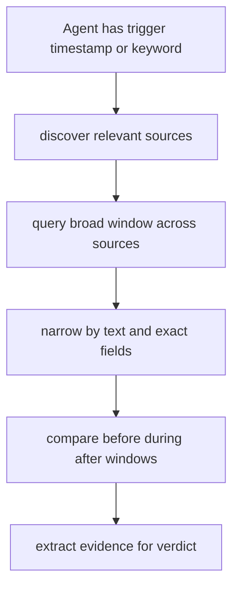

# Kibana Log Investigation MCP

## Problem Frame

An agent needs a small, reliable MCP surface to investigate staging incidents and validation workflows through Kibana logs without direct manual Kibana use. The immediate driver is the logs-investigation portion of `../digital-api/STAGING_TEST_PROTOCOL.md`, which requires correlating consumer logs, API logs, and metric-like log events around a precise `ICC:B2C_OPENING_DATES` reload window.

The MCP should stay general. It should not hardcode this one protocol, but it must make this protocol easy to execute by giving agents a short path to the right sources, the right time window, and evidence-rich results.

## Approach Comparison

| Approach | Description | Pros | Cons | Recommendation |
|---|---|---|---|---|
| Dynamic environment discovery | Discover every reachable Kibana source and infer fields at runtime | Very general | More brittle, more backend complexity, weaker predictability for v1 | No |
| Configured source catalog plus general query modes | Operators define logical sources and field hints, while agents use generic `discover` and `query` tools | Small surface, predictable, fits the staging use case well, still general through configuration | Requires setup for each environment | Yes |
| Protocol-specific investigation helpers | Add tools tailored to reload validation steps | Fastest for this one protocol | Hardcodes one workflow and weakens reuse | No |

## Requirements

**Source Discovery**
- R1. The MCP must expose a `discover` capability that returns a concise catalog of logical log sources relevant to investigation work.
- R2. Each source result must include a stable source id, human-readable name, time field, short description, and source tags or aliases that help an agent choose the right source quickly.
- R3. `discover` must expose enough field guidance for an agent to form exact-match filters without guessing blindly. This can be inline field hints in the source result.

**Querying and Correlation**
- R4. The MCP must expose a `query` capability that accepts one or more source ids plus absolute start and end timestamps.
- R5. `query` must support both free-text search and exact field filters in the same request.
- R6. `query` must support at least these modes inside one tool: raw hits, count-only, histogram over time, and grouped counts by field.
- R7. `query` results must be normalized enough for cross-source correlation, including source provenance and a normalized timestamp for every returned hit or bucket.
- R8. `query` must preserve access to the underlying raw document so agents can inspect source-specific details when normalization is not enough.

**Safety and Operability**
- R9. The MCP must be explicitly read-only and operate against a Kibana environment secured by basic auth.
- R10. The server must fail clearly when credentials, endpoint configuration, or read permissions are wrong.
- R11. Every `query` response must echo the effective query plan, including sources, time bounds, filters, mode, and truncation decisions, so agent investigations are auditable.

## Success Criteria

- An agent can find the configured consumer, API, and metric-like log sources needed for the logs portion of `../digital-api/STAGING_TEST_PROTOCOL.md`.
- An agent can isolate the relevant `ICC:B2C_OPENING_DATES` execution window using count or histogram queries before requesting raw hits.
- An agent can retrieve evidence for `MEMOIZE_TREE_RELOAD_STATS`, `PRODUCT_OPENING_DATES_REFRESH_PHASES`, and related reload events in a way that supports cross-source correlation.
- An agent can compare before, during, and after windows using repeated `query` calls without needing extra protocol-specific tools.
- The same MCP can be reused for a different incident or environment by changing source configuration rather than changing code.

## Scope Boundaries

- No Redis inspection in this MCP.
- No staging API execution or request triggering in this MCP.
- No Kibana dashboard, saved object, or visualization management.
- No write or admin capabilities.
- No natural-language-only query interface in v1.
- No hardcoded `ICC:B2C_OPENING_DATES` or protocol-specific helper tools in v1.

## Key Decisions

- Use a configured logical source catalog rather than full dynamic environment discovery.
- Keep the primary tool shape to `discover` and `query`, with field guidance folded into discovery for v1.
- Keep counts, histograms, and grouped counts inside `query` rather than creating extra aggregate tools.
- Optimize the response shape for correlation and evidence extraction, not just backend fidelity.
- Scope this product to logs investigation only, even though the full staging protocol also references API and Redis validation.

## Dependencies / Assumptions

- Operators can provide Kibana base URL, basic-auth credentials, and the set of logical sources to expose.
- The relevant log sources contain searchable text and/or structured fields for at least some identifiers such as locale, product id, request id, or layer name.
- The Kibana environment provides a stable enough read path for discovery and structured search.

## Outstanding Questions

### Resolve Before Planning
- None.

### Deferred to Planning
- [Affects R1-R3][Technical] Should field hints come only from configuration in v1, or should the server optionally enrich them from backend metadata when available?
- [Affects R4-R11][Technical] Which Kibana-facing read path should the client target first for the highest probability of a simple implementation?
- [Affects R6-R8][Technical] What normalized result envelope best balances correlation-friendly fields with raw-document fidelity?

## Next Steps

-> `/prompts:ce-plan` for structured implementation planning
