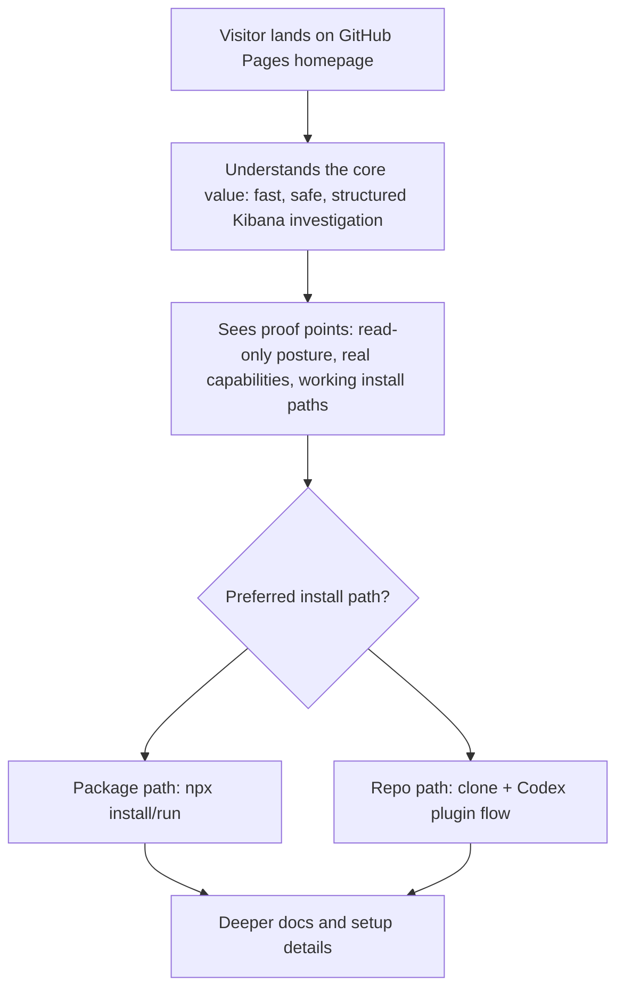

# GitHub Pages Homepage

## Problem Frame

The repository now has a working published package, release pipeline, and stronger install story, but its public entry surfaces still do not behave like a coherent adoption page. There is no GitHub Pages site yet, and the repository README is still carrying too much of the public narrative burden.

The goal is to create a one-page GitHub Pages homepage that works for both AI-agent operators and developers evaluating the tool for their team. It should explain why the MCP exists, show what it can do, establish trust, and give visitors two equally visible ways to install it: clone-free package use and the repo-local Codex/plugin path.

## User Flow

## Requirements

**Page Shape**
- R1. The first version must be a single-page GitHub Pages homepage, not a multi-page docs site.
- R2. The homepage must work as a hybrid product-and-engineering landing page rather than a generic docs index or a README clone.
- R3. The page must be understandable to both AI-agent operators and developers evaluating the MCP for a team, without making either audience feel secondary.

**Core Narrative**
- R4. The homepage must present the core value proposition as a combined message: fast, safe, structured Kibana investigation for agents and teams.
- R5. The homepage must explain why the MCP exists before diving into implementation or configuration detail.
- R6. The homepage must make the read-only posture visible as a trust signal, not bury it in footnotes.

**Install Experience**
- R7. The homepage must present two installation paths as first-class options: the published package path and the repo-local Codex/plugin path.
- R8. Neither install path should be visually or rhetorically treated as a secondary fallback on the homepage.
- R9. The homepage must show the two install choices near the top of the page, while keeping the full copy-paste commands below the initial narrative layer.
- R10. The install story must remain truthful to the current product contract: the package path is live, and the repo-local/plugin path remains a supported primary path for Codex users.

**Trust and Proof**
- R11. The homepage must balance three trust signals together: read-only safety, real installability, and concrete investigation capabilities.
- R12. The page must show enough feature substance that a visitor can tell this is a working investigation tool rather than a thin wrapper or concept page.
- R13. The page must avoid overstating capabilities that are environment-dependent, especially schema-aware behavior and setup automation details that depend on client/runtime context.

**Tone and Presentation**
- R14. The visual and copy tone must be a confident hybrid: polished, but clearly engineering-first.
- R15. The homepage must feel intentional and credible, not like a generated marketing page or a plain internal doc export.
- R16. The page should stay concise enough that a visitor can understand the product and pick an install path quickly without paging through a full documentation site.
- R20. The first impression must be Warp-led: dark, high-contrast, immediate, and visually assertive rather than documentation-first.
- R21. The hero must use a split composition that pairs terminal-style install/setup action with product-style investigation proof.
- R22. The install choice near the top of the page must use a controlled toggle or tab presentation rather than two fully expanded command blocks competing in the hero.
- R23. The page should use noticeable but purposeful motion, especially in the hero and workflow proof area, without relying on generic decorative animation.
- R24. Designed mockups may be used for the first version, but they must remain clearly representative of the real product workflow and trust boundaries.

**Cross-Surface Consistency**
- R17. The homepage, `README.md`, `INSTALL.md`, and public metadata must describe the same product, install paths, and trust posture.
- R18. The homepage must link cleanly into deeper setup and reference material instead of trying to replace operator docs completely.
- R19. Public-facing copy must stay aligned with the current release and distribution reality: GitHub Releases and npm are live, and version authority lives there rather than in the `package.json` version committed in git.

## Success Criteria

- A first-time visitor can explain what the MCP is for within a short scan of the homepage.
- A visitor can see both install paths quickly and choose one without ambiguity.
- The homepage increases confidence by showing both safety posture and real capability, not just one or the other.
- The page feels suitable for sending to another engineer or operator as the main public entry point.
- The homepage does not contradict `README.md`, `INSTALL.md`, npm, or GitHub Releases.

## Scope Boundaries

- No multi-page documentation site in the first version.
- No custom domain requirement in this tranche.
- No analytics, CMS, blog, or server-side functionality.
- No change to MCP runtime behavior, release behavior, or install mechanics as part of this brainstorm.
- No attempt to move all operator documentation onto the homepage.

## Key Decisions

- **One-page first:** The first release should be a single focused homepage to reduce maintenance and keep the public story sharp.
- **Dual-path install CTA:** The site should give equal prominence to `npx` and repo-local Codex/plugin installation rather than forcing a single winner.
- **Balanced trust framing:** Read-only safety, installability, and real capabilities should all be visible near the top-level story.
- **Hybrid audience:** The copy should serve both operators and evaluators rather than optimizing exclusively for one persona.
- **Engineering-first polish:** The site should be more polished than repo docs, but still clearly signal that this is a serious engineering tool.
- **Warp-led entry, Sentry-like proof:** The hero should borrow Warp's immediacy and visual energy, while the sections below should become calmer and more structured for product proof.
- **Outcome-first messaging:** The headline should lead with faster Kibana investigation outcomes, while the supporting copy explains the MCP model rather than leading with protocol mechanics.
- **Workflow-first proof:** The first proof section below the hero should show one flowing investigation experience before trust policy or feature taxonomy.
- **Designed but honest mockups:** The page can use art-directed visuals, but the compositions must still reflect the actual install and investigation contract.

## Visual Direction

- **Primary inspiration:** Warp for the hero's immediacy, CTA posture, command-centered energy, and darker visual atmosphere.
- **Secondary inspiration:** Sentry for structured product proof, tighter information hierarchy, and calmer mid-page explanation.
- **Hero mood:** Dark terminal-forward surface with warm accent lighting, sharp contrast, and meaningful motion that supports the install and workflow story.
- **Typography posture:** Punchy, compact hero copy followed by more composed, clearer product sections below.
- **Visual honesty rule:** Mockups should look better than raw screenshots, but they must not imply capabilities or polished surfaces the product does not actually provide.

## Proposed Page Structure

1. **Hero**
   - Outcome-first headline focused on faster Kibana investigations for agents and teams.
   - Subheadline explains that the advantage comes from structured MCP access to Kibana workflows.
   - Top install chooser presented as `npx` / `Repo + Codex` tabs with primary CTA and a secondary workflow CTA.
   - Split hero visual combining a terminal-style install surface and a product-style investigation output surface.

2. **Investigation Flow**
   - A pseudo-live, art-directed sequence that reads as one coherent session rather than a feature grid.
   - Flow should show source discovery, field inspection, focused querying, and structured output.

3. **Why It Exists**
   - Short narrative explaining that Kibana is powerful for humans but awkward for repeatable agent workflows.
   - Clarifies the role of structured access without turning into protocol documentation.

4. **Trust Strip**
   - Compact high-signal proof row covering read-only posture, npm distribution, GitHub Releases, and repo-local Codex support.

5. **Feature Proof**
   - Structured proof blocks for discovery, field inspection, tighter queries, and reusable setup/profile ergonomics.
   - Each block should use a small representative visual fragment rather than generic icon cards.

6. **Install**
   - Full copy-paste install paths presented with equal weight for `npx` and `Repo + Codex`.
   - Each path should include a short “best for” framing and a brief next-step expectation.

7. **Boundaries and Support**
   - Clarifies read-only boundaries, environment-dependent setup realities, and links to deeper operational docs.

8. **Final CTA**
   - Repeats both install paths and links visitors to npm, GitHub Releases, `README.md`, and `INSTALL.md`.

## Dependencies / Assumptions

- The homepage will need clean links into the current install and support documents.
- The public site must inherit the current release/distribution truth rather than older “planned package” messaging.
- The repo will need a low-maintenance GitHub Pages deployment path once planning begins.

## Outstanding Questions

### Resolve Before Planning
- None.

### Deferred to Planning
- [Affects R1-R3][Technical] What is the lowest-maintenance Pages deployment shape that fits the repo’s existing GitHub Actions posture?
- [Affects R20-R24][Design] What is the lightest implementation approach that can deliver the chosen hero motion and mockup treatment without creating fragile maintenance overhead?

## Next Steps

-> /ce:plan for structured implementation planning
