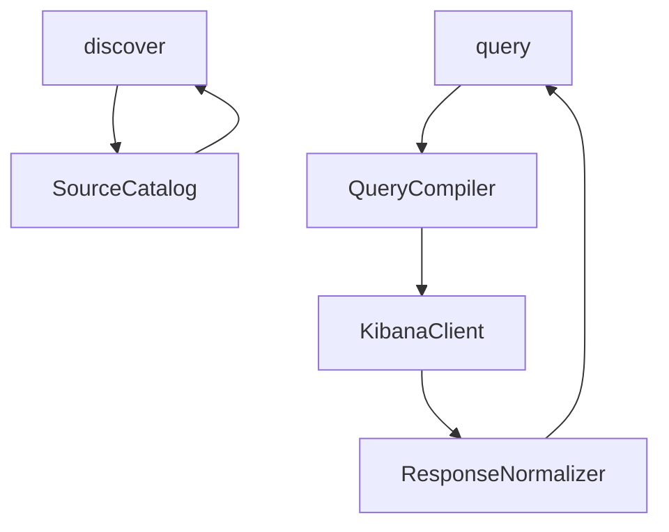

# feat: Add Kibana log investigation MCP

## Overview

Build a standalone MCP server for read-only Kibana log investigation. The v1 shape should stay small: `discover` exposes a configured catalog of logical sources, and `query` provides raw hits plus lightweight aggregate modes that help agents find and explain runtime behavior around an incident window.

## Problem Frame

The target user is another agent performing investigation work. The immediate use case is a logs-focused workflow that requires correlating application, API, and structured metric-like log events around a precise trigger window. Planning should preserve that concrete utility while keeping the MCP general enough to support other incidents through configuration rather than custom tools. See origin: `docs/brainstorms/2026-04-02-kibana-log-investigation-requirements.md`.

## Requirements Trace

- R1-R3. Expose a concise, field-aware discovery surface for logical sources.
- R4-R8. Support multi-source, multi-mode querying with normalized, evidence-friendly responses.
- R9-R11. Keep the server read-only, basic-auth compatible, and auditable through explicit query echoes and clear failures.

## Scope Boundaries

- No Redis inspection.
- No API execution or trigger orchestration.
- No Kibana administration, dashboard management, or saved-object mutation.
- No workflow-specific helper tools in v1.
- No live tail or streaming behavior in v1.

## Context & Research

### Relevant Code and Patterns

- The current repo has no implementation code yet, only `docs/sources/handoff.md` and documentation artifacts, so there are no local code patterns to preserve.
- TypeScript and Node.js are the natural fit for a small standalone MCP server with straightforward transport and validation needs.
- The motivating investigation workflow is the main behavioral reference for what “useful investigation” means in practice.

### Institutional Learnings

- No `docs/solutions/` material exists in this workspace today.

### External References

- None used. The repo and motivating workflow are sufficient for this first plan.

## Key Technical Decisions

- Use a standalone TypeScript and Node.js MCP server so the project starts from a low-friction stack.
- Represent log surfaces as configured logical sources rather than dynamically discovering every reachable Kibana source in v1.
- Keep the public MCP surface to `discover` and `query` in v1, with field hints included in `discover`.
- Support `hits`, `count`, `histogram`, and `terms`-style grouped counts inside `query` instead of adding extra tools.
- Normalize outputs for correlation and evidence extraction while always retaining raw document access.

## Open Questions

### Resolved During Planning

- Should the MCP be general or workflow-specific? It should be general, with one realistic workflow used as a grounding case rather than hardcoded product behavior.
- Should discovery be dynamic or configured for v1? It should be configured for v1 because that is the highest-probability simple path.
- Should logs-only scope include Redis or API actions? No. Those remain outside this MCP and belong to other tools or manual capabilities.

### Deferred to Implementation

- Which exact Kibana read endpoint family is the simplest reliable target for the first client implementation?
- Whether backend metadata enrichment for field hints is worth adding after the config-only baseline works.
- How aggressively to normalize message-like content when different sources expose different primary text fields.

## High-Level Technical Design

> *This illustrates the intended approach and is directional guidance for review, not implementation specification. The implementing agent should treat it as context, not code to reproduce.*

The design separates configuration, compilation, backend access, and response shaping so the two public tools stay small even if backend details evolve.

## Implementation Units

- [ ] **Unit 1: Scaffold the standalone MCP server and config loading**

**Goal:** Establish the TypeScript project, runtime entrypoint, config loading, and shared types needed for a small standalone server.

**Requirements:** R1-R11

**Dependencies:** None

**Files:**
- Create: `package.json`
- Create: `tsconfig.json`
- Create: `src/index.ts`
- Create: `src/server.ts`
- Create: `src/config.ts`
- Create: `src/types.ts`
- Create: `vitest.config.ts`
- Create: `test/config.test.ts`
- Modify: `README.md`

**Approach:**
- Initialize a minimal ESM TypeScript project with the MCP SDK, schema validation for config, and a small runtime entrypoint.
- Define the operator-facing config shape early: Kibana base URL, credentials, timeout defaults, and an array of logical source definitions.
- Keep shared types explicit so discovery, query compilation, and normalization use the same contracts.

**Patterns to follow:**
- Prefer small explicit modules because this repo has no established abstraction style yet.

**Test scenarios:**
- Happy path: valid config loads and produces normalized source definitions.
- Error path: missing Kibana credentials fails with a clear validation error.
- Error path: invalid source catalog shape fails before server startup.

**Verification:**
- The project can start with a valid config object, and invalid config is rejected before tool registration.

- [ ] **Unit 2: Implement the logical source catalog and `discover` tool**

**Goal:** Provide a compact discovery surface that helps agents choose sources and candidate fields quickly.

**Requirements:** R1-R3, R9

**Dependencies:** Unit 1

**Files:**
- Create: `src/source_catalog.ts`
- Create: `src/tools/discover.ts`
- Create: `test/source_catalog.test.ts`
- Create: `test/discover.test.ts`

**Approach:**
- Represent each logical source with id, name, description, tags, time field, backend locator, and optional field hints.
- Let `discover` support keyword filtering over ids, names, descriptions, and tags.
- Keep the default response concise, with enough field guidance for exact filtering but not a full schema dump.

**Patterns to follow:**
- Keep tool handlers thin and move filtering and shaping logic into `src/source_catalog.ts`.

**Test scenarios:**
- Happy path: `discover` returns all configured sources with stable ids and metadata.
- Happy path: keyword search narrows the catalog by tags and names.
- Edge case: sources with no optional field hints still return a valid discovery record.
- Error path: unknown search terms return an empty result set rather than failing.

**Verification:**
- An agent can discover the configured consumer, API, and metric-like sources and see enough metadata to choose among them.

- [ ] **Unit 3: Implement query compilation and Kibana client execution**

**Goal:** Turn agent-friendly query parameters into a read-only backend request path for one or more logical sources.

**Requirements:** R4-R6, R9-R11

**Dependencies:** Units 1-2

**Files:**
- Create: `src/kibana_client.ts`
- Create: `src/query/compiler.ts`
- Create: `src/tools/query.ts`
- Create: `test/query_compiler.test.ts`
- Create: `test/kibana_client.test.ts`

**Approach:**
- Define a compact `query` input schema with `source_ids`, `start_time`, `end_time`, `text`, exact `filters`, `mode`, `limit`, `sort`, and optional aggregation parameters.
- Compile that schema into a backend request per source, then fan out and merge results under one tool response.
- Keep the client explicitly read-only, with auth headers, timeouts, and error translation that surfaces endpoint or permission failures clearly.

**Execution note:** Start with compiler-level tests before wiring the backend client so input and output contracts are stable first.

**Patterns to follow:**
- Keep backend-specific logic in `src/kibana_client.ts` and avoid leaking it into the public tool contract.

**Test scenarios:**
- Happy path: a hits query with one source compiles expected time bounds, filters, text query, and limit.
- Happy path: a multi-source count query compiles one backend request per source and returns merged counts.
- Happy path: histogram mode compiles interval parameters and returns bucketed results.
- Error path: unsupported query mode is rejected by input validation.
- Error path: backend timeout or auth failure becomes a clear MCP tool error.
- Integration: merged multi-source queries preserve per-source provenance in the returned structure.

**Verification:**
- An agent can run hits, count, and histogram queries across one or more logical sources and receive predictable failures when the backend cannot satisfy the request.

- [ ] **Unit 4: Normalize results for correlation and evidence extraction**

**Goal:** Make `query` outputs easy to correlate across sources and easy to quote in a validation report.

**Requirements:** R7-R8, R11

**Dependencies:** Unit 3

**Files:**
- Create: `src/query/normalize.ts`
- Modify: `src/tools/query.ts`
- Create: `test/query_normalize.test.ts`

**Approach:**
- Standardize a hit envelope with normalized timestamp, source id, summary text, selected evidence fields, and raw document.
- Standardize aggregate envelopes for counts, histograms, and grouped counts with explicit field names and source context.
- Always include a query echo section that records effective sources, time bounds, filters, mode, limit, and truncation behavior.

**Patterns to follow:**
- Favor additive normalization: keep raw data available rather than transforming it destructively.

**Test scenarios:**
- Happy path: a mixed-source hits response returns normalized timestamps and source ids for every hit.
- Happy path: grouped counts return field name, bucket value, count, and source context.
- Edge case: hits missing a preferred message field still return raw documents and a safe fallback summary.
- Edge case: truncated result sets clearly indicate truncation in the query echo or metadata.

**Verification:**
- An agent can line up events from multiple sources without source-specific parsing and can still inspect the full raw document when needed.

- [ ] **Unit 5: Register MCP tools and document the operator workflow**

**Goal:** Expose the finished tool surface and make the server usable with a sample source catalog.

**Requirements:** R1-R11

**Dependencies:** Units 1-4

**Files:**
- Create: `config/sources.example.json`
- Modify: `src/server.ts`
- Modify: `README.md`
- Create: `test/server.test.ts`

**Approach:**
- Register exactly the `discover` and `query` tools in v1.
- Provide an example source catalog showing how to model application, API, and metrics-like log sources without encoding one workflow directly into tool names or logic.
- Document the required environment variables, config structure, and expected query patterns for before/during/after investigation flows.

**Patterns to follow:**
- Keep operator docs as close as possible to the tool contracts and example source config.

**Test scenarios:**
- Happy path: the server registers `discover` and `query` only.
- Happy path: example source catalog parses successfully.
- Integration: a tool call route from server registration to handler execution uses the shared schemas correctly.

**Verification:**
- A new operator can boot the server with sample config, see the two tools, and understand how to configure sources for a typical investigation workflow.

## System-Wide Impact

- **Interaction graph:** The main moving parts are source config, query compilation, backend client execution, and response normalization.
- **Error propagation:** Auth, timeout, and permission failures should surface as explicit tool errors rather than partial silent responses.
- **State lifecycle risks:** The server should stay stateless between calls so repeated investigations do not leak context across requests.
- **API surface parity:** The v1 public surface stays limited to `discover` and `query`; no extra helper tools should appear unless the discovery payload proves insufficient.
- **Integration coverage:** Multi-source fanout and normalization need integration-style tests because unit tests alone will not prove merged response behavior.
- **Unchanged invariants:** The server remains read-only and does not execute external API requests, mutate Kibana, or inspect Redis.

## Risks & Dependencies

- Kibana read APIs may differ across environments, so the client layer needs a narrow adapter boundary and clear failure messages.
- Source metadata may be incomplete if operators do not provide field hints, so v1 should work with config-only hints before attempting runtime enrichment.
- Multi-source hits queries can become expensive if defaults are loose, so the tool should keep explicit limits and require absolute time windows.
- Message normalization may be imperfect across heterogeneous sources, which is why raw-document access remains mandatory.
