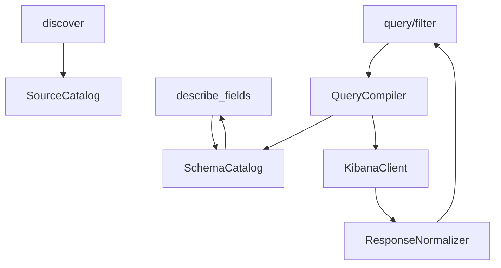

# feat: Add schema-aware investigation features to Kibana MCP

## Overview

Evolve the existing Kibana MCP from a source-catalog search tool into a schema-aware investigation tool that can answer the remaining log-analysis needs in `features-v1.md` without forcing agents back to direct Elasticsearch calls or manual Kibana inspection.

This is a second-phase plan. The repo already ships `configure`, `discover`, `filter`, and `query`, along with runtime source-catalog persistence and arbitrary hit sorting. The work here is to close the remaining capability gaps while keeping the MCP general and the public surface intentionally small.

## Problem Frame

The current MCP can already:

- discover configured sources
- execute multi-source hits, count, histogram, and grouped-count queries
- run exact-field filtering through `filter`
- sort hits by arbitrary fields
- persist runtime source catalogs across MCP restarts

It still cannot reliably answer investigation questions that depend on:

- knowing whether `event` or `event.keyword` is the safe exact-match field
- inspecting nested array content such as `slowest_layers[]`
- paging through very large hit sets
- computing numeric summary stats and percentiles
- retrieving “top N per bucket” evidence instead of only global top hits

Those gaps are exactly what drove the fallback described in `features-v1.md`.

## Requirements Trace

- F1. Add field and mapping introspection for configured sources.
- F2. Make exact-match filtering safe when the caller knows the logical field but not the exact keyword-safe variant.
- F3-F4. Support nested filtering and compact nested evidence extraction.
- F5. Add cursor-based pagination for large hit sets.
- F6. Add numeric stats aggregations, including percentiles.
- F7. Add grouped top-hit retrieval.
- F8. Support correlation-timeline workflows without forcing raw backend calls.
- F9. Avoid repeated re-bootstrap friction for environment-based configuration.

## Scope Boundaries

- No protocol-specific tool for `STAGING_TEST_PROTOCOL.md`.
- No Redis inspection, trigger execution, or staging API orchestration.
- No write access to Kibana, Elasticsearch, or data views.
- No silent rewriting of exact field names passed to `filter`; that tool remains the explicit “I know the backend field” path.
- No attempt to implement every possible Elasticsearch aggregation in this tranche.

## Context & Research

### Current Repo State

- The public surface is implemented in `src/server.ts` and currently registers `configure`, `discover`, `filter`, and `query`.
- Query compilation is centralized in `src/query/compiler.ts`.
- Result shaping is centralized in `src/query/normalize.ts`.
- Backend execution is centralized in `src/kibana_client.ts`.
- Source metadata currently comes only from static configuration plus field hints in `src/source_catalog.ts`.
- `AGENTS.md` references `RTK.md`, but `RTK.md` is not present in this workspace, so no additional repo standards were available beyond the checked-in files and AGENTS instructions.

### Institutional Learnings

- `docs/solutions/integration-issues/kibana-mcp-config-reset-after-restart-2026-04-03.md` established an important operating rule for this repo: persist non-secret runtime state, but keep credentials in environment variables. This matters because new schema-aware features must not reintroduce restart-sensitive configuration.

### External References

- Elastic field capabilities API documents that field metadata can expose `type`, `searchable`, and `aggregatable`, which makes it the right primitive for `describe_fields`.
- Elastic nested query and inner hits docs confirm that nested filtering and per-match extraction require actual `nested` mappings and that `inner_hits` is the supported way to return only matching nested objects.
- Elastic pagination docs recommend `search_after` over deep `from`/`size`, and they require stable sort values plus a tiebreaker for reliable continuation.
- Elastic aggregation docs confirm that `percentiles` is the correct primitive for p50/p95/p99 and that `top_hits` is intended as a sub-aggregation within a bucket aggregation.

## Key Technical Decisions

- Add one new public tool: `describe_fields`. This is the minimum surface increase that materially improves agent reliability.
- Keep `discover` lightweight. Full mapping output does not belong in discovery responses.
- Make `query` schema-aware. Logical exact filters and aggregations should resolve to the safest exact-match field variant when the caller uses logical field names.
- Keep `filter` literal. If the caller passes `event`, the server must use `event`; it may warn, but it must not silently rewrite.
- Treat nested support as a first-class query feature, but only for fields that are actually mapped as `nested`.
- Ship deep pagination only for `hits` and only for single-source requests in this tranche. Multi-source global pagination is materially more complex and not required to close the primary investigation gap.
- Add numeric stats and grouped top hits as additional `query` modes rather than additional public tools.
- Do not add a separate `timeline` tool in this tranche. A stable ascending `hits` query plus correlation filters, nested extraction, and cursor pagination is sufficient to support the timeline workflow without expanding the surface again.
- Do not add a `configure_from_env` tool. The existing startup env bootstrap plus persisted runtime source catalog already covers the operational need behind F9.

## Open Questions

### Resolved During Planning

- Should schema introspection live in `discover` or a separate tool? Separate tool. `discover` must stay concise.
- Should exact-match safety rewrite `filter` requests automatically? No. `filter` is intentionally exact.
- Should grouped top hits be a new tool? No. It fits naturally as a `query` mode.
- Should timeline reconstruction become a dedicated tool now? No. The workflow can be covered by enhancing `query`.

### Deferred to Implementation

- Which backend path has the highest probability for schema introspection in the target environment: direct Elasticsearch-compatible field-cap calls, or a Kibana-mediated metadata path?
- Whether nested evidence extraction should default to source filtering or docvalue-style field selection for performance when `inner_hits` are large.
- Whether grouped top hits should initially support only one `group_by` field or allow a later nested-bucket extension.

## High-Level Technical Design

> This is directional guidance for review, not implementation code.

The architectural change is the introduction of schema awareness as a reusable layer. `describe_fields` exposes it directly, and `query` uses it to make safer choices for exact filtering, nested queries, pagination, and aggregation compilation.

## Implementation Units

- [ ] **Unit 1: Add schema metadata retrieval and the `describe_fields` tool**

**Goal:** Expose per-source field capabilities so agents can stop guessing field variants, aggregatability, and nested paths.

**Requirements:** F1, F2

**Dependencies:** None

**Files:**
- Create: `src/schema_catalog.ts`
- Create: `src/tools/describe_fields.ts`
- Modify: `src/types.ts`
- Modify: `src/server.ts`
- Modify: `src/kibana_client.ts`
- Create: `test/schema_catalog.test.ts`
- Create: `test/describe_fields.test.ts`
- Modify: `test/server.test.ts`
- Modify: `README.md`

**Approach:**
- Introduce a schema metadata layer that can fetch and cache field capabilities for a configured source.
- Use backend metadata that can expose at least:
  - field name
  - type family
  - searchable
  - aggregatable
  - nested-path information when available
  - subfield relationships such as `.keyword`
- Make `describe_fields(source_id)` return concise, agent-usable metadata rather than the raw backend payload.
- Include a `preferred_exact_field` or equivalent derived hint when a logical field has a safer exact-match variant.

**Patterns to follow:**
- Keep backend I/O in `src/kibana_client.ts` or a sibling backend module, not inside tool handlers.
- Keep source-level schema caching in a dedicated module so query compilation can reuse it.

**Test scenarios:**
- Happy path: `describe_fields` returns type, searchable, aggregatable, and subfield metadata for a configured source.
- Happy path: a text field with a `.keyword` multifield exposes the multifield and marks it as the preferred exact variant.
- Edge case: a field that exists with different type families across indices is surfaced as ambiguous instead of silently collapsed.
- Error path: schema metadata failure for one source produces a clear tool error.

**Verification:**
- An agent can inspect a source and determine whether `event`, `event.keyword`, or another subfield is the safe choice for term filters and aggregations.

- [ ] **Unit 2: Make `query` exact-match and aggregation resolution schema-aware**

**Goal:** Let agents use logical field names safely in `query` without knowing backend mapping details.

**Requirements:** F2, F6, F7, F8

**Dependencies:** Unit 1

**Files:**
- Modify: `src/query/compiler.ts`
- Modify: `src/query/normalize.ts`
- Modify: `src/tools/query.ts`
- Modify: `src/tools/filter.ts`
- Modify: `src/types.ts`
- Modify: `test/query_compiler.test.ts`
- Modify: `test/query_normalize.test.ts`
- Modify: `test/filter.test.ts`
- Modify: `README.md`

**Approach:**
- Extend the query compiler so exact filter fields, `group_by`, and aggregation fields can resolve through schema metadata, not just static field hints.
- Prefer keyword-safe or otherwise exact-capable field variants for `query` when the logical field itself is not aggregatable or is unsafe for exact term semantics.
- Preserve `filter` as exact-field literal behavior.
- Add a structured `warnings` or `advisories` section to the response envelope so agents can explain when the effective field differed from the requested logical field.

**Patterns to follow:**
- Continue treating `query` as the ergonomic path and `filter` as the explicit escape hatch.
- Keep all resolution decisions visible in `query_echo` or a sibling metadata section.

**Test scenarios:**
- Happy path: `query` term filtering on a logical text field resolves to its keyword-safe exact field.
- Happy path: `terms` grouping on a logical field resolves to an aggregatable exact field.
- Happy path: `filter` still uses the literal field name passed by the caller.
- Edge case: no safe exact variant exists, and the response includes a clear warning or error instead of a misleading zero-hit result.

**Verification:**
- An agent can ask for exact event matches without manually discovering or hardcoding `.keyword` first.

- [ ] **Unit 3: Add nested filters and nested evidence extraction**

**Goal:** Support layer-level investigation inside nested log arrays such as `slowest_layers[]`.

**Requirements:** F3, F4, F8

**Dependencies:** Units 1-2

**Files:**
- Modify: `src/types.ts`
- Modify: `src/query/compiler.ts`
- Modify: `src/query/normalize.ts`
- Modify: `src/tools/query.ts`
- Modify: `src/tools/filter.ts`
- Modify: `src/kibana_client.ts`
- Create: `test/nested_query_compiler.test.ts`
- Create: `test/nested_normalize.test.ts`
- Modify: `test/server.test.ts`
- Modify: `README.md`

**Approach:**
- Add explicit nested-query input shape rather than overloading flat `filters`.
- Compile nested filters into Elasticsearch `nested` queries with `inner_hits` so the response can include only the matching nested objects.
- Add normalized nested match output that carries:
  - root hit identifiers such as timestamp and document id
  - matching nested object payloads
  - nested path metadata
- Reject nested requests against paths that are not known to be mapped as `nested`.

**Patterns to follow:**
- Keep nested semantics explicit in the public contract. Do not infer nesting from dotted field names alone.
- Keep raw parent documents available even when nested extraction is enabled.

**Test scenarios:**
- Happy path: a nested filter returns parent hits plus only the matching nested object payload.
- Happy path: nested extraction for `slowest_layers.layer` returns compact evidence fields for the matching layer.
- Error path: requesting nested filtering on a non-nested path fails with a clear schema error.
- Edge case: multiple nested matches in one parent hit are all returned in stable order.

**Verification:**
- An agent can inspect one problematic layer inside a reload stats event without manually parsing the whole parent document.

- [ ] **Unit 4: Add cursor pagination for large hit sets**

**Goal:** Make large investigations workable when a correlation key yields tens of thousands of documents.

**Requirements:** F5, F8

**Dependencies:** Units 1-2

**Files:**
- Modify: `src/types.ts`
- Modify: `src/query/compiler.ts`
- Modify: `src/query/normalize.ts`
- Modify: `src/tools/query.ts`
- Modify: `src/kibana_client.ts`
- Modify: `test/query_compiler.test.ts`
- Modify: `test/query_normalize.test.ts`
- Create: `test/pagination.test.ts`
- Modify: `README.md`

**Approach:**
- Add cursor pagination for `hits` via `search_after`.
- Scope the first release to single-source `hits` queries only.
- Require a stable sort tuple:
  - requested sort field or source time field
  - deterministic tiebreaker field
- Return `next_cursor` only when another page exists.
- Encode the cursor as an opaque token that includes the source id, sort tuple, and continuation values so clients do not hand-craft backend details.

**Patterns to follow:**
- Keep pagination mechanics in the compiler/client boundary, not in tool handlers.
- Make cursor invalidation explicit when the caller changes query shape or sort order.

**Test scenarios:**
- Happy path: first page returns `next_cursor`, and the second page resumes from the last hit.
- Edge case: changing sort direction or source id with an old cursor is rejected.
- Edge case: queries without an explicit sort still paginate using a stable default tuple.
- Scope guard: multi-source hits with cursor pagination are rejected with a clear error in this tranche.

**Verification:**
- An agent can walk a very large single-source result set without dropping to raw backend pagination.

- [ ] **Unit 5: Add numeric stats and grouped top hits as new `query` modes**

**Goal:** Support latency and cost analysis workflows that depend on summaries and “worst per key” evidence.

**Requirements:** F6, F7, F8

**Dependencies:** Units 1-2

**Files:**
- Modify: `src/types.ts`
- Modify: `src/query/compiler.ts`
- Modify: `src/query/normalize.ts`
- Modify: `src/tools/query.ts`
- Modify: `test/query_compiler.test.ts`
- Modify: `test/query_normalize.test.ts`
- Create: `test/query_stats.test.ts`
- Create: `test/query_grouped_top_hits.test.ts`
- Modify: `README.md`

**Approach:**
- Add `stats` mode for numeric summary queries on one field, with optional `group_by`.
- Implement the numeric summary using standard numeric aggs plus `percentiles` for p50, p95, and p99.
- Add `grouped_top_hits` mode that:
  - buckets by one field
  - sorts hits within each bucket by another field
  - returns the top N hits per bucket
- Keep both modes per-source in the response envelope, matching the current multi-source aggregation pattern.

**Patterns to follow:**
- Reuse the existing mode-driven compiler and normalizer instead of adding parallel handler code.
- Keep group semantics explicit in the response so agents can quote bucket keys and top evidence cleanly.

**Test scenarios:**
- Happy path: `stats` returns count, min, max, avg, sum, p50, p95, and p99 for a numeric field.
- Happy path: grouped `stats` returns one stats block per bucket key.
- Happy path: `grouped_top_hits` returns the highest `total_duration_ms` hit per `request_id`.
- Edge case: stats on a non-numeric field fail clearly.
- Edge case: grouped top hits on a non-aggregatable bucket field fail clearly or emit a schema-backed warning before backend execution when possible.

**Verification:**
- An agent can summarize duration distributions and fetch the worst reload event per correlation key through the MCP alone.

- [ ] **Unit 6: Close the feature-document deltas in docs and compatibility tests**

**Goal:** Finish the tranche by explicitly documenting what from `features-v1.md` is implemented, what is intentionally not a separate tool, and why.

**Requirements:** F8, F9

**Dependencies:** Units 1-5

**Files:**
- Modify: `README.md`
- Modify: `features-v1.md`
- Modify: `test/server.test.ts`
- Optionally create: `docs/solutions/feature-shapes/schema-aware-querying-2026-04-03.md`

**Approach:**
- Document that:
  - `timeline` is covered through `query` plus sorting, filters, and cursor pagination
  - `configure_from_env` is already operationally covered by startup env bootstrap and runtime source-catalog persistence
- Update feature examples so they show the intended investigation workflows directly.
- Add compatibility-style tests that prove the server advertises the expected tool surface after this tranche.

**Patterns to follow:**
- Prefer documenting why a feature did not become a new tool instead of silently omitting it.

**Test scenarios:**
- Happy path: tool registration includes `describe_fields` and does not introduce unnecessary extra helpers.
- Documentation parity: README examples match the final public request shapes.
- Regression: env-bootstrap startup plus persisted runtime sources still work after schema-aware additions.

**Verification:**
- The feature list and the shipped public surface no longer diverge in ways that force agents to guess what exists.

## System-Wide Impact

- **Public surface:** Adds one new tool, `describe_fields`, and expands `query` rather than fragmenting the MCP into many specialized helpers.
- **Backend access shape:** Introduces read-only schema metadata calls in addition to search calls.
- **Response contract:** Adds advisories, nested evidence, cursor metadata, and new aggregate result shapes.
- **Performance profile:** Schema caching and pagination must prevent repeated heavy metadata fetches and deep-hit overfetching.
- **Failure modes:** The server must distinguish schema-unavailable, field-unsupported, and backend-search failures clearly.
- **Operational invariants:** Credentials remain environment-backed; runtime source persistence remains the only durable client-supplied state.

## Sequencing

1. Implement schema introspection first. Every other feature depends on accurate field knowledge.
2. Use that schema layer to harden exact-match resolution before adding more modes.
3. Add nested support next because it changes both compilation and normalization.
4. Add cursor pagination after sort semantics and nested response shapes are stable.
5. Add stats and grouped top hits last, reusing the now schema-aware compiler.
6. Finish with docs and compatibility cleanup so the final surface is coherent.

## Recommended Execution Posture

Implement this tranche characterization-first at the compiler and normalizer boundaries:

- lock the current `query` and `filter` behavior with tests before changing schemas
- add schema-resolution tests before backend metadata wiring
- add integration-style tests for each new mode and response envelope change

This repo is still small, but these features all change the MCP contract. The cheapest way to avoid drift is to keep the tests ahead of the handler and normalization changes.
