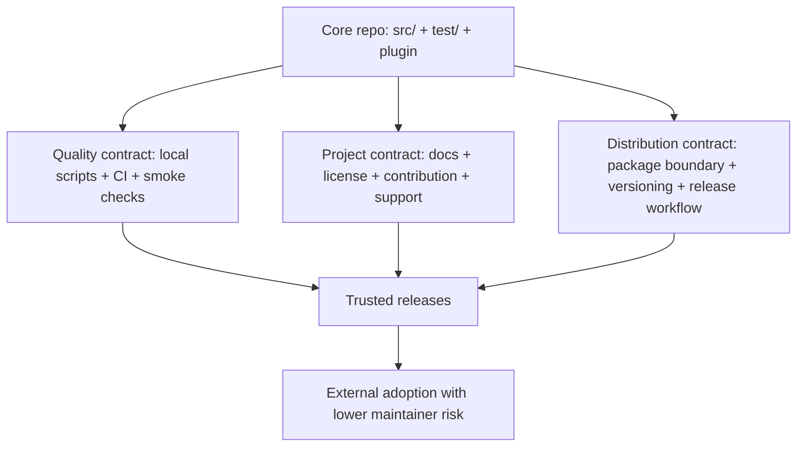
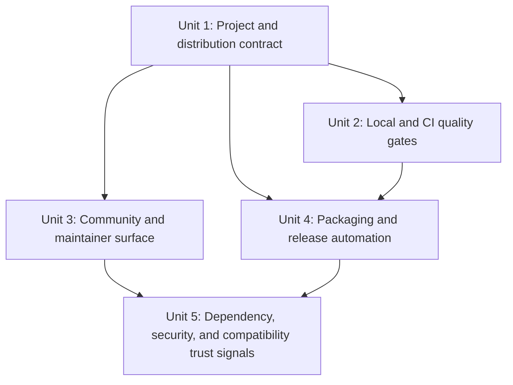

# refactor: Professionalize Kibana MCP project operations

## Overview

Turn the repository from a strong local prototype into a maintainable, externally credible project. The MCP surface and local Codex plugin already exist and are tested; the gap is around project operations: contributor onboarding, governance, CI, release discipline, packaging boundaries, and trust signals for outside users.

## Problem Frame

The codebase is further along than a prototype in product terms: it has a focused TypeScript implementation in `src/`, a meaningful test suite in `test/`, operator handoff guidance in `INSTALL.md`, and a repo-scoped plugin under `plugins/kibana-log-investigation/`. What it lacks is the operational surface expected from a professional project:

- `package.json` still declares `"private": true`, so the current distribution model is effectively repo-local only.
- the root of the repo does not include `LICENSE`, `CONTRIBUTING.md`, `SECURITY.md`, or GitHub community templates even though `plugins/kibana-log-investigation/.codex-plugin/plugin.json` already advertises public GitHub-facing metadata and an MIT license
- there is no `.github/workflows/` directory, so build, typecheck, and test quality are not enforced outside a maintainer's machine
- there is no lint/format gate, release workflow, changelog discipline, or dependency automation
- the documentation explains product behavior well, but it does not yet define support boundaries, release expectations, or compatibility posture for external adopters

The goal of this plan is to close those gaps without widening product scope. This is a repository-maturity plan, not a new-feature plan.

## Requirements Trace

**Quality Gates**
- R1. The project must have deterministic local and CI quality gates for install, lint/format, typecheck, tests, and build output.

**Distribution Contract**
- R2. The distribution contract must be explicit: repo-local Codex plugin install remains supported, and any public package/release path must have a clean, verified artifact boundary.

**Community Health**
- R3. The repository must expose professional community-health surfaces: license, contributing guidance, security reporting path, ownership, and issue/PR intake.

**Release Management**
- R4. Release management must be auditable and low-friction, with clear versioning and changelog generation.

**Documentation & Metadata Accuracy**
- R5. Documentation and metadata must accurately describe supported environments, install paths, and known environmental limitations.

**Dependency & Supply-Chain Hygiene**
- R6. Dependency and supply-chain hygiene must be visible enough that maintainers can keep the project current without relying on memory.

## Scope Boundaries

- No redesign of the MCP tool surface beyond metadata or packaging changes required by this plan.
- No attempt to build a hosted SaaS, docs website, or multi-runtime port.
- No promise of broad Kibana/Elasticsearch compatibility beyond what can be documented and verified honestly.
- No expansion into non-log workflows such as Redis inspection or API-trigger orchestration.
- No forced public npm release in the first tranche if the package boundary is not yet stable enough to support it.

## Context & Research

### Relevant Code and Patterns

- `src/server.ts` keeps the public MCP surface explicit and centralized, which is a good anchor for smoke checks and artifact-verification rules.
- `src/config.ts` already separates secrets from persisted runtime state; repo governance and docs should preserve that separation rather than blur it.
- `test/` already covers config parsing, discovery, filtering, schema behavior, query compilation, and server registration. The maturity work should reuse this existing test posture instead of introducing parallel verification systems.
- `INSTALL.md` is already the operator handoff guide mandated by `AGENTS.md`; professionalization work should extend that operator-first posture rather than replacing it.
- `plugins/kibana-log-investigation/.mcp.json` and `plugins/kibana-log-investigation/.codex-plugin/plugin.json` form an external contract: build output path, plugin metadata, and install instructions must stay aligned.

### Institutional Learnings

- `docs/solutions/integration-issues/kibana-mcp-config-reset-after-restart-2026-04-03.md` establishes a project norm: persist non-secret operator state, keep credentials in environment variables. Release and onboarding docs should reinforce that split.
- `docs/solutions/integration-issues/kibana-mcp-schema-endpoints-may-be-unavailable-2026-04-03.md` shows that environment compatibility is nuanced. Professional docs must not overpromise schema-aware behavior across all Kibana deployments.

### External References

- GitHub Docs: licensing a repository clarifies that, without a license, default copyright rules apply even if the repo looks public-facing.
- GitHub Docs: secure-repository quickstart recommends a `SECURITY.md` policy and security posture setup for maintainers.
- GitHub Docs: issue and pull request templates improve intake quality and align contributors with repository guidelines.
- npm Docs: a publishable package must be intentionally described and packaged; artifact contents should not be left implicit.
- npm Docs: trusted publishing via OIDC is the preferred future path if this repo graduates to public npm releases from GitHub Actions.

## Key Technical Decisions

- **Professionalize in stages, not in one giant “open source polish” sweep:** The repo already has a working product surface. The fastest durable path is to land a small number of high-leverage repo contracts in order: project posture, CI, governance, release packaging, then trust automation. This reduces drift and makes each layer verifiable before the next one depends on it.
- **Treat repo-local plugin install as the current source of truth until packaging is proven:** Today the only explicit install contract is local clone -> `npm install` -> `npm run build` -> repo plugin install. Public distribution should be added only after the artifact boundary is verified, not before.
- **Use GitHub-native repository surfaces first:** The plugin metadata already points at GitHub URLs, and this repo is naturally organized around GitHub-style contribution flow. That makes `.github/` workflows, templates, and ownership files the lowest-friction professionalization path.
- **Keep the automation surface minimal but enforceable:** Add one canonical local quality command sequence and one primary CI workflow before layering more advanced automation. A professional project needs reliable gates, not an elaborate but brittle workflow graph.
- **Make environmental limitations part of the support contract:** Schema endpoint variability and runtime source persistence are not side notes; they materially affect what users can expect. Those realities belong in support and compatibility docs, not only in solution notes.

## Open Questions

### Resolved During Planning

- Should this plan expand the product scope? No. It is limited to repository maturity and releaseability.
- Should the repo flip immediately to public npm publishing? No. The package boundary should be verified first; release automation should support a future publish path without forcing it prematurely.
- Should repo health be modeled around GitHub-native workflows and docs? Yes. The existing plugin metadata and expected collaboration flow already assume GitHub-facing usage.

### Deferred to Implementation

- Whether the first external release vehicle should be npm, GitHub Releases, or both once the package boundary is verified.
- Whether organization-level community health defaults exist and should supersede some repo-local files.
- Whether advanced GitHub security features such as CodeQL or Dependabot auto-triage are available on the maintainer's plan tier.

## High-Level Technical Design

> *This illustrates the intended approach and is directional guidance for review, not implementation specification. The implementing agent should treat it as context, not code to reproduce.*

The core idea is to turn the current implementation into a trustworthy product surface by adding three contracts around it: quality, project governance, and distribution. Trusted releases are the output of those contracts aligning.

## Alternative Approaches Considered

- **Docs-only polish first:** Rejected because it improves appearance without preventing broken installs, broken release artifacts, or build drift.
- **Immediate public npm release:** Rejected for now because the current package is still marked private and no pack/release verification exists yet.
- **Large “open source launch” expansion including website and marketing assets:** Rejected because it adds visibility before the repo has basic contributor and release discipline.

## Success Metrics

- A fresh clone on the supported Node line can pass the canonical verification flow without maintainer-specific tribal knowledge.
- Every pull request is gated on the same checks maintainers rely on locally.
- A new contributor can tell how to contribute, how to report a vulnerability, what license applies, and what environments are actually supported.
- A maintainer can cut a release candidate artifact with deterministic contents and without manual version bookkeeping drift.
- The plugin metadata, docs, and build output no longer disagree about install path, ownership, or support posture.

## Dependencies / Prerequisites

- GitHub repository admin access to add workflows, templates, and branch protections.
- Maintainer agreement on the intended license and on whether public registry distribution is a near-term goal.
- If npm publishing is enabled later, access to the target npm scope and permission to configure trusted publishing.

## Implementation Units

- [ ] **Unit 1: Define the project and distribution contract**

**Goal:** Make the repo explicit about who it serves, how it is installed, what is supported, and how future releases should be understood.

**Requirements:** R2, R4, R5

**Dependencies:** None

**Files:**
- Create: `docs/project/distribution-strategy.md`
- Create: `docs/project/support-policy.md`
- Modify: `README.md`
- Modify: `INSTALL.md`
- Modify: `package.json`
- Modify: `plugins/kibana-log-investigation/.codex-plugin/plugin.json`

**Approach:**
- Define the supported install paths explicitly: repo-local Codex plugin install is guaranteed; public package/release support is phased.
- Record the intended versioning policy, support boundary, and compatibility stance in docs instead of leaving them implicit.
- Align plugin metadata URLs, license declaration, and support claims with real project documents instead of generic repo placeholders.

**Patterns to follow:**
- Keep operator workflow guidance in `INSTALL.md`.
- Keep user-facing product contract in `README.md`.
- Put maintainer rationale and policies in `docs/project/` so the README stays focused.

**Test scenarios:**
- Test expectation: none -- this unit establishes repo policy, metadata alignment, and support boundaries rather than executable behavior.

**Verification:**
- A maintainer and a first-time adopter can answer "How do I install this, what is supported, and where do I ask for help?" from checked-in docs and metadata alone.

- [ ] **Unit 2: Add canonical local checks and GitHub CI enforcement**

**Goal:** Ensure the same verification path runs on contributor machines and on pull requests.

**Requirements:** R1, R5

**Dependencies:** Unit 1

**Files:**
- Create: `.editorconfig`
- Create: `.github/workflows/ci.yml`
- Create: `test/project_contract.test.ts`
- Create: `scripts/verify-mcp-entrypoint.mjs`
- Modify: `package.json`
- Modify: `README.md`
- Modify: `plugins/kibana-log-investigation/.mcp.json`
- Modify: `tsconfig.json`

**Approach:**
- Add a single canonical script set for lint/format, typecheck, test, build, and contract verification.
- Gate pull requests on a clean checkout running those same checks on the supported Node line.
- Add a small artifact contract check that proves the compiled entrypoint expected by `plugins/kibana-log-investigation/.mcp.json` matches the actual build output.
- Keep the workflow deliberately small: fail early on environment or contract drift before layering more advanced automation.

**Technical design:** *(directional guidance, not implementation specification)* Use a repo-level contract test and a thin verification script to assert that `package.json` scripts, `tsconfig.json` output layout, and plugin entrypoint metadata all converge on the same `dist` shape.

**Patterns to follow:**
- Reuse the existing Vitest test posture in `test/` for repo contract checks.
- Keep runtime logic in `src/` untouched unless a smoke/contract assertion requires a small export or hook.

**Test scenarios:**
- Happy path: a clean checkout on the supported Node line passes lint/format, typecheck, tests, build, and entrypoint verification.
- Edge case: changing `tsconfig.json` output layout without updating plugin metadata causes the contract test or verification script to fail clearly.
- Error path: missing or renamed quality scripts in `package.json` break CI in a way that points directly at the contract violation.
- Integration: the built entrypoint referenced by `plugins/kibana-log-investigation/.mcp.json` is the same path verified in the local test suite and CI workflow.

**Verification:**
- A pull request that would break local installation or build reproducibility fails before merge, and the failure points to a concrete contract mismatch.

- [ ] **Unit 3: Add the community-health and maintainer surface**

**Goal:** Give contributors and adopters the expected governance, support, and ownership entry points.

**Requirements:** R3, R5

**Dependencies:** Unit 1

**Files:**
- Create: `LICENSE`
- Create: `CONTRIBUTING.md`
- Create: `SECURITY.md`
- Create: `.github/CODEOWNERS`
- Create: `.github/ISSUE_TEMPLATE/bug_report.yml`
- Create: `.github/ISSUE_TEMPLATE/feature_request.yml`
- Create: `.github/pull_request_template.md`
- Modify: `README.md`
- Modify: `plugins/kibana-log-investigation/.codex-plugin/plugin.json`

**Approach:**
- Make the top-level license match the intended rights already implied by plugin metadata, or update the metadata if a different license is chosen.
- Write contribution guidance that is specific to this repo's operating reality: Node 22+, local plugin install, example source catalogs, schema endpoint caveats, and solution-note-driven debugging.
- Add issue and PR templates that collect the details this project actually needs for triage, including backend kind, schema backend kind, Kibana version/proxy shape when known, and reproduction windows.
- Define ownership and vulnerability reporting so maintainers do not need to improvise process in public threads.

**Patterns to follow:**
- Reuse the product terminology already present in `README.md`, `config/sources.example.json`, and `docs/solutions/`.
- Keep templates focused on reproducibility rather than generic open-source boilerplate.

**Test scenarios:**
- Test expectation: none -- this unit adds governance and documentation artifacts rather than runtime behavior.

**Verification:**
- The repository's GitHub community profile has its core health files, and issue/PR intake captures the information needed to reproduce Kibana-environment bugs.

- [ ] **Unit 4: Harden the packaging boundary and automate release preparation**

**Goal:** Make releases reproducible and the published artifact boundary auditable before any public registry push is attempted.

**Requirements:** R2, R4, R5

**Dependencies:** Units 1-2

**Files:**
- Create: `.changeset/config.json`
- Create: `.changeset/README.md`
- Create: `.github/workflows/release.yml`
- Create: `CHANGELOG.md`
- Create: `scripts/verify-packlist.mjs`
- Create: `test/package_contract.test.ts`
- Modify: `package.json`
- Modify: `README.md`
- Modify: `plugins/kibana-log-investigation/.mcp.json`

**Approach:**
- Define which files belong in a release artifact explicitly instead of relying on npm defaults.
- Add a packlist verification step that proves the release candidate includes the runtime entrypoint, plugin metadata, and essential docs while excluding repo-local noise such as tests and untracked config.
- Introduce version/changelog automation so release notes and version bumps are derived from reviewed changes rather than maintained manually.
- Keep public npm publishing phase-gated. The release workflow should be able to stop at validated release artifacts until maintainers intentionally enable external registry publishing.
- If npm publishing is enabled later, prefer trusted publishing from GitHub Actions over long-lived tokens.

**Technical design:** *(directional guidance, not implementation specification)* Treat `npm pack` or equivalent artifact creation as a testable contract. The release workflow should run the same quality gates as CI, then run artifact verification, then branch into release-only versus release-plus-publish depending on the chosen distribution mode.

**Patterns to follow:**
- Reuse repo-local scripts for release verification instead of encoding complex logic only inside GitHub Actions.
- Keep the release artifact definition close to `package.json` and the plugin install contract.

**Test scenarios:**
- Happy path: the release candidate artifact contains the built runtime, plugin metadata, README, and license material required for redistribution.
- Edge case: untracked operator files such as `config/sources.runtime.json` or test-only fixtures are excluded from the release artifact.
- Error path: a missing built entrypoint or mismatched package include list fails pack verification before any tag-based release is published.
- Integration: the release workflow uses the same build/test/contract verification path as normal CI before generating versioned outputs.

**Verification:**
- A maintainer can cut a release candidate artifact with deterministic contents, and the repo clearly distinguishes "validated artifact" from "publicly published package."

- [ ] **Unit 5: Add dependency, security, and compatibility trust signals**

**Goal:** Reduce silent drift and make the project's support posture visible to adopters.

**Requirements:** R5, R6

**Dependencies:** Units 3-4

**Files:**
- Create: `.github/dependabot.yml`
- Create: `.github/workflows/dependency-review.yml`
- Create: `docs/project/compatibility-matrix.md`
- Create: `docs/project/release-checklist.md`
- Modify: `README.md`
- Modify: `INSTALL.md`

**Approach:**
- Add dependency update automation and dependency-review checks so routine maintenance does not depend on a maintainer remembering to look.
- Publish a compatibility matrix that distinguishes guaranteed paths from best-effort ones: supported Node line, repo-local plugin install, search backend kinds, schema backend caveats, and what happens when schema endpoints are unavailable.
- Add a concise release checklist that ties together docs verification, artifact verification, and compatibility review so each release does not reinvent the process.
- Add badges or external trust signals only after the underlying workflows exist and are green.

**Patterns to follow:**
- Base compatibility claims on `README.md`, `config/sources.example.json`, and the known environment lessons in `docs/solutions/`.
- Keep release checklists short and outcome-oriented so they stay maintained.

**Test scenarios:**
- Test expectation: none -- this unit adds automation configuration and support documentation rather than new runtime behavior.

**Verification:**
- Maintainers receive routine dependency/security prompts, and adopters can tell which environments and install modes are supported without reading solution archaeology.

## System-Wide Impact

- **Interaction graph:** `package.json`, `tsconfig.json`, plugin metadata, GitHub workflows, release scripts, and top-level docs become one shared contract rather than loosely related files.
- **Error propagation:** Today, build-output drift or metadata drift could escape until a user tries the plugin manually. After this plan, those failures should surface in contract tests or CI before release.
- **State lifecycle risks:** Version numbers, release notes, and support docs can drift independently unless the release process derives them from one source of truth.
- **API surface parity:** Installation and support promises must stay aligned across `README.md`, `INSTALL.md`, `plugins/kibana-log-investigation/.codex-plugin/plugin.json`, and release artifacts.
- **Integration coverage:** Unit tests alone will not prove repo maturity. Cross-file contract checks must cover build output location, package contents, workflow expectations, and documentation promises.
- **Unchanged invariants:** The MCP remains a read-only stdio server, still centered on Node 22+ and a local plugin install path even as release options expand.

## Risks & Dependencies

| Risk | Mitigation |
|------|------------|
| A public-facing license or support claim is added without actual maintainer intent behind it. | Make Unit 1 the explicit contract-setting step and block downstream rollout until maintainers agree on license and support posture. |
| CI or release automation becomes more complex than the project can sustain. | Start with one primary CI workflow and one release-prep workflow, both reusing repo-local scripts instead of embedding logic only in YAML. |
| Packaging work exposes that the current repo layout is not yet safe to publish cleanly. | Keep public publish disabled until pack verification passes; validated release artifacts are a useful intermediate milestone. |
| Security or dependency automation assumes GitHub plan features that may not be enabled. | Separate baseline open features (templates, Dependabot, dependency review where available) from optional advanced scanning, and document any skipped controls explicitly. |
| Documentation promises outrun real environment support, especially around schema-aware behavior. | Tie compatibility claims to tested backends and to the known limitations already captured in `docs/solutions/`. |

## Documentation / Operational Notes

- Keep `INSTALL.md` as the primary operator runbook because `AGENTS.md` explicitly directs agents there first.
- Add a short "Project maturity" or "Support and releases" section near the top of `README.md` so users see the repo posture before diving into tool details.
- When release automation is added, branch protection should require the CI workflow before tags or release branches are treated as authoritative.
- If/when npm publishing is enabled, document whether releases are published from tags, from a release branch, or from a manually approved workflow so maintainers do not guess.

## Sources & References

- Related code: `src/server.ts`
- Related code: `src/config.ts`
- Related code: `plugins/kibana-log-investigation/.mcp.json`
- Related code: `plugins/kibana-log-investigation/.codex-plugin/plugin.json`
- Related docs: `INSTALL.md`
- Related docs: `README.md`
- Related solution: `docs/solutions/integration-issues/kibana-mcp-config-reset-after-restart-2026-04-03.md`
- Related solution: `docs/solutions/integration-issues/kibana-mcp-schema-endpoints-may-be-unavailable-2026-04-03.md`
- External docs: https://docs.github.com/en/repositories/managing-your-repositorys-settings-and-features/customizing-your-repository/licensing-a-repository
- External docs: https://docs.github.com/en/code-security/getting-started/quickstart-for-securing-your-repository
- External docs: https://docs.github.com/articles/about-issue-and-pull-request-templates
- External docs: https://docs.npmjs.com/about-packages-and-modules/
- External docs: https://docs.npmjs.com/trusted-publishers/
