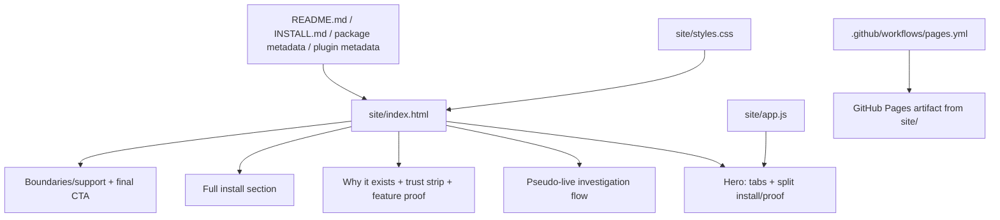

# feat: Launch GitHub Pages homepage for Kibana MCP

## Overview

Launch a one-page GitHub Pages homepage for this repository that acts as the public adoption surface for the Kibana MCP: Warp-led in first impression, structured and credible below the fold, and explicit about the two supported install paths (`npx` and repo-local Codex/plugin setup). This plan supersedes `docs/plans/2026-04-08-002-feat-github-pages-site-plan.md`, which was written against an older distribution and release story.

## Problem Frame

The product now has a stronger real-world story than the repository currently tells. The homepage does not exist yet, and the local checkout still shows drift across public surfaces: GitHub URLs point at the old owner, several docs still describe the public package path as planned, and release documents still reflect the pre-semantic-release flow. Shipping a GitHub Pages homepage without first-class cross-surface realignment would create a polished front door on top of contradictory underlying surfaces.

The new requirements doc establishes the product and design decisions already: one page only, both audiences served equally, both install paths visible, read-only trust posture visible, and a Warp-led hero followed by calmer Sentry-like proof sections (see origin: `docs/brainstorms/2026-04-11-github-pages-homepage-requirements.md`). Planning now needs to solve the implementation shape: the lightest static-site approach that can deliver that visual hierarchy without creating a brittle maintenance burden.

## Requirements Trace

- R1-R3. Provide a single-page GitHub Pages homepage that works as a public adoption surface for both operators and evaluators.
- R4-R6. Lead with faster investigation outcomes, explain why structured MCP access exists, and keep read-only posture visible.
- R7-R10. Surface both install paths near the top, keep full copy-paste commands lower on the page, and stay truthful to the live package plus supported repo-local plugin flow.
- R11-R13. Prove real capability without overstating environment-dependent schema or setup behavior.
- R14-R16, R20-R24. Deliver a Warp-led dark hero, split install/proof composition, controlled install tabs, purposeful motion, and designed-but-honest mockups.
- R17-R19. Keep the homepage, `README.md`, `INSTALL.md`, package metadata, plugin metadata, and project docs aligned with the current release and distribution reality.

## Scope Boundaries

- No multi-page documentation site in this tranche.
- No framework migration or new frontend toolchain just to ship the homepage.
- No server-side rendering, analytics, CMS, or custom backend.
- No change to MCP runtime behavior, tool contracts, release mechanics, or install mechanics.
- No custom domain, OG image pipeline, or social card generator in the first release.

### Deferred to Separate Tasks

- Social-preview image generation and richer social metadata after the homepage content stabilizes.
- Any future multi-page expansion such as a dedicated install page or FAQ.
- A custom domain if maintainers decide the public site should move beyond the default GitHub Pages URL.

## Context & Research

### Relevant Code and Patterns

- `README.md` currently acts as both repo landing page and product explanation, which makes it too reference-heavy to serve as a clean public adoption funnel.
- `INSTALL.md` is still the canonical Codex/operator handoff document, but the local checkout still frames public package use as planned rather than live.
- `package.json` and `plugins/kibana-log-investigation/.codex-plugin/plugin.json` still point homepage and repository URLs at the old GitHub owner in this checkout, making public metadata alignment part of the Pages rollout.
- `test/package_contract.test.ts` and `test/project_contract.test.ts` already enforce repo-level contract checks, so the homepage can extend an existing verification style rather than inventing a new one.
- `.github/workflows/ci.yml` and `.github/workflows/release.yml` show the repo already uses lightweight Node-based GitHub Actions workflows and can accommodate a Pages workflow without introducing a new platform.

### Institutional Learnings

- `docs/solutions/documentation-gaps/self-contained-codex-install-handoff-2026-04-08.md` shows that adoption improves when install instructions are self-contained, explicit, and honest about fallbacks and environment-specific setup.
- `docs/solutions/integration-issues/kibana-mcp-config-reset-after-restart-2026-04-03.md` reinforces that durable setup is part of the product story; the homepage should mention saved setup/profile ergonomics without implying secret persistence.
- `docs/solutions/integration-issues/kibana-mcp-schema-endpoints-may-be-unavailable-2026-04-03.md` reinforces that schema-aware features are environment-dependent and must not be marketed as universal behavior.

### External References

- GitHub recommends a custom GitHub Actions workflow for Pages when you want a build process other than Jekyll or do not want a dedicated branch holding compiled files. Source: [Configuring a publishing source for your GitHub Pages site](https://docs.github.com/en/pages/getting-started-with-github-pages/configuring-a-publishing-source-for-your-github-pages-site).
- GitHub’s custom workflow guidance for Pages requires `actions/configure-pages`, `actions/upload-pages-artifact`, and `actions/deploy-pages`, with `pages: write` and `id-token: write` permissions and a `github-pages` environment on deploy. Source: [Using custom workflows with GitHub Pages](https://docs.github.com/en/pages/getting-started-with-github-pages/using-custom-workflows-with-github-pages).

## Key Technical Decisions

- **Use a checked-in static `site/` source tree with hand-authored HTML, CSS, and minimal vanilla JavaScript:** This is the lowest-maintenance way to deliver the chosen visual direction without introducing a framework, bundler, or generator that the repo otherwise does not need.
- **Implement the designed mockups directly in HTML/CSS instead of image-only hero art:** This keeps the homepage responsive, inspectable, and easier to keep honest as the product evolves. The motion and terminal/product surfaces can be art-directed while remaining grounded in real copy and real install commands.
- **Limit JavaScript to progressive enhancement:** JavaScript should handle the `npx` / `Repo + Codex` install tabs and minor interaction polish only. Layout, motion, and most visual treatment should remain CSS-driven so the page still works if scripting fails.
- **Deploy `site/` through a dedicated GitHub Pages Actions workflow:** This avoids polluting `docs/` or requiring a `gh-pages` branch, and it matches GitHub’s current Pages guidance for custom workflows.
- **Use relative asset and internal links throughout the site artifact:** GitHub project pages live under a repository subpath, so the homepage must not depend on root-relative asset URLs that would break once deployed under `/kibana-mcp-server/`.
- **Treat cross-surface realignment as part of the homepage launch:** The Pages site cannot be the only truthful surface. `README.md`, `INSTALL.md`, package/plugin metadata, and project policy docs must be updated together so the public story converges.

## Open Questions

### Resolved During Planning

- Should this be a framework-backed site? No. A static `site/` tree with HTML, CSS, and small progressive-enhancement JavaScript is the right maintenance boundary for this repo.
- Should the hero and workflow proof use exported image mockups or DOM-rendered compositions? DOM-rendered compositions. That keeps the mockups responsive, inspectable, and easier to keep representative of the product.
- Should the Pages workflow introduce a separate build pipeline? No. The site artifact can be deployed directly from `site/` without a distinct frontend build step.

### Deferred to Implementation

- Exact copy for the hero headline, proof strip labels, and CTA buttons once the implementer sees the page in-browser.
- Final motion timings and accent treatments once the static composition is visible and can be tuned for readability.
- Whether the package and plugin metadata should move to the Pages URL in the same commit as first deployment or immediately after the first successful Pages publish.

## Output Structure

```text
site/
├── 404.html
├── app.js
├── index.html
└── styles.css
```

## High-Level Technical Design

> *This illustrates the intended approach and is directional guidance for review, not implementation specification. The implementing agent should treat it as context, not code to reproduce.*



The site should be a static, DOM-driven composition: the hero and proof surfaces are visually designed but implemented as real HTML/CSS panels rather than a stack of screenshots. Deploying `site/` directly keeps the workflow simple, while contract tests ensure the new public surface and repo-native surfaces tell the same story.

## Implementation Units

- [x] **Unit 1: Build the static homepage surface in `site/`**

**Goal:** Create the one-page homepage artifact that delivers the approved visual hierarchy, narrative flow, and dual install presentation.

**Requirements:** R1-R16, R20-R24

**Dependencies:** None

**Files:**
- Create: `site/index.html`
- Create: `site/styles.css`
- Create: `site/app.js`
- Create: `site/404.html`
- Test: `test/site_contract.test.ts`

**Approach:**
- Implement the page as one semantic HTML document with section anchors matching the agreed structure: hero, investigation flow, why it exists, trust strip, feature proof, install, boundaries/support, final CTA.
- Build the hero as a split composition using HTML/CSS panels: left side terminal/install energy, right side structured investigation proof. The install selector should be tabbed and progressively enhanced by `site/app.js`.
- Keep the pseudo-live investigation flow DOM-rendered rather than screenshot-based so the implementer can art-direct it while staying close to the real product vocabulary.
- Use CSS for the heavy lifting: dark hero atmosphere, warm accents, controlled reveals, panel glow, and motion. Reserve JavaScript for tab state, reduced-friction CTA behavior, and accessibility-safe interaction polish.
- Keep all links and assets relative to the site root so the artifact works on a GitHub project page path.

**Execution note:** Start by locking the semantic section structure in `test/site_contract.test.ts`, then shape the visual treatment on top of that contract.

**Patterns to follow:**
- Use the page structure defined in `docs/brainstorms/2026-04-11-github-pages-homepage-requirements.md`.
- Use the operator truth from `INSTALL.md`, `README.md`, and `docs/project/support-policy.md` rather than inventing new claims in the site copy.

**Test scenarios:**
- Happy path: `site/index.html` contains the required sections for hero, workflow proof, install, and boundaries/support.
- Happy path: both install paths (`npx` and `Repo + Codex`) are present in the markup and have distinct copy-paste command surfaces in the install section.
- Edge case: with JavaScript disabled, the install content remains understandable and the page still exposes both install paths.
- Edge case: links and asset references avoid root-relative paths so the page still resolves correctly from a GitHub Pages project-site subpath.
- Error path: if a future edit removes the read-only trust language or collapses the page back into a generic doc shell, `test/site_contract.test.ts` fails.
- Integration: the site’s claims about schema-aware behavior, saved setup, and install support match the current operator docs instead of introducing a more optimistic story.

**Verification:**
- Opening `site/index.html` locally gives a coherent, scannable page where a first-time visitor can understand the product and choose an install path without reading the README first.

- [x] **Unit 2: Add GitHub Pages deployment workflow and deployment contract checks**

**Goal:** Deploy the static artifact through GitHub Pages with the smallest operational footprint that still matches GitHub’s recommended workflow contract.

**Requirements:** R1, R17-R19

**Dependencies:** Unit 1

**Files:**
- Create: `.github/workflows/pages.yml`
- Modify: `test/project_contract.test.ts`
- Test: `test/site_contract.test.ts`

**Approach:**
- Add a dedicated Pages workflow triggered on pushes to `master` and manual dispatch.
- Use `actions/configure-pages`, `actions/upload-pages-artifact`, and `actions/deploy-pages`, targeting the `site/` directory as the published artifact.
- Keep the workflow intentionally simple: no site build step, no additional package install, no separate toolchain. The artifact is the checked-in static directory.
- Extend the project contract test so the repo fails verification if the Pages workflow disappears or no longer points at the `site/` artifact.
- Document in the plan and later docs that the repository’s Pages source must be configured to GitHub Actions in GitHub settings.

**Patterns to follow:**
- Mirror the existing workflow style in `.github/workflows/ci.yml` and `.github/workflows/release.yml`.
- Follow GitHub’s official Pages workflow contract from the external references above.

**Test scenarios:**
- Happy path: `.github/workflows/pages.yml` includes the official Pages actions and targets `site/` as the upload path.
- Happy path: the deploy job declares `pages: write` and `id-token: write` permissions plus the `github-pages` environment.
- Error path: if the artifact path changes away from `site/` or the workflow drops one of the required Pages actions, `test/project_contract.test.ts` fails.
- Integration: the deployed Pages artifact can be produced without a Node install or frontend build step beyond the repo’s existing CI/release workflows.

**Verification:**
- A push to `master` can publish the `site/` artifact through GitHub Pages after repository settings are pointed at GitHub Actions.

- [x] **Unit 3: Realign repo-native public surfaces around the hosted homepage**

**Goal:** Make the repository, package metadata, and plugin metadata reinforce the homepage instead of contradicting it or telling an older story.

**Requirements:** R7-R10, R17-R19

**Dependencies:** Units 1-2

**Files:**
- Modify: `README.md`
- Modify: `INSTALL.md`
- Modify: `package.json`
- Modify: `package-lock.json`
- Modify: `plugins/kibana-log-investigation/.codex-plugin/plugin.json`
- Test: `test/package_contract.test.ts`
- Test: `test/site_contract.test.ts`

**Approach:**
- Rewrite the top of `README.md` so the repo landing surface acts as a funnel into the hosted homepage and deeper operator docs instead of carrying the entire public narrative alone.
- Update `INSTALL.md` to preserve its role as the canonical operator handoff while removing stale “public package is planned” language and linking back to the homepage where appropriate.
- Update package and plugin metadata so homepage/repository/website URLs reflect the current GitHub owner and, when appropriate, the hosted Pages URL.
- Treat the current checkout’s drift as explicit work: the homepage launch should not assume the repo metadata is already aligned with the live npm/GitHub reality.
- Extend package/site contract coverage so metadata drift and public-surface drift fail tests quickly.

**Patterns to follow:**
- Keep installation truth aligned with `docs/brainstorms/2026-04-11-github-pages-homepage-requirements.md`.
- Follow the existing contract-test style in `test/package_contract.test.ts`.

**Test scenarios:**
- Happy path: `README.md` points readers to the homepage while still exposing the supported repo-native install flow.
- Happy path: `INSTALL.md` remains self-contained for operators but no longer contradicts the live package/release reality.
- Edge case: package and plugin metadata reference the current repo owner and public entry surface rather than the stale old owner URLs.
- Error path: if the homepage and repo-native docs diverge on whether `npx` is live or whether repo-local Codex install is supported, a contract test fails.
- Integration: repository visitors can move coherently from `README.md` to the homepage and then into `INSTALL.md` without seeing contradictory install, support, or release claims.

**Verification:**
- The repo, package metadata, plugin metadata, and homepage describe one coherent product and one coherent set of install options.

- [x] **Unit 4: Update project policy and compatibility docs to reflect the homepage launch**

**Goal:** Ensure the deeper project docs continue to be authoritative and stay aligned with the new public surface.

**Requirements:** R11-R13, R17-R19

**Dependencies:** Unit 3

**Files:**
- Modify: `docs/project/distribution-strategy.md`
- Modify: `docs/project/support-policy.md`
- Modify: `docs/project/release-checklist.md`
- Modify: `docs/project/compatibility-matrix.md`
- Test: `test/site_contract.test.ts`

**Approach:**
- Update project docs where necessary so the homepage links into truthful deeper references rather than linking into stale policies.
- Bring distribution and compatibility language in line with the current published package and release pipeline reality.
- Add homepage verification to the release checklist so the Pages surface is reviewed as part of normal maintenance, not treated as one-off launch copy.
- Keep these docs technical and authoritative; the homepage should summarize them, not replace them.

**Patterns to follow:**
- Reuse the repo’s current docs structure under `docs/project/`.
- Follow the existing release-governance posture already established in the repo, updating stale release-PR/Changesets language where present in this checkout.

**Test scenarios:**
- Happy path: deeper docs describe the live package, repo-local plugin path, and release process consistently with the homepage.
- Edge case: support-policy caveats about schema-dependent behavior remain visible in the deeper docs and are summarized accurately on the homepage.
- Error path: if a future doc edit reintroduces “package path is planned” language or old release-process language, the contract coverage catches the regression.
- Integration: homepage links land on docs whose detailed guidance reinforces, rather than revises, the public story.

**Verification:**
- The homepage can confidently deep-link into `docs/project/*` because those documents reflect the same current contract.

## System-Wide Impact

- **Interaction graph:** `site/` becomes the primary public narrative surface; `README.md`, `INSTALL.md`, package metadata, plugin metadata, and `docs/project/*` become supporting surfaces that must agree with it.
- **Error propagation:** If the homepage overstates install simplicity or schema-aware behavior, users will hit avoidable setup failures even though the MCP runtime is unchanged.
- **State lifecycle risks:** Public copy drift is the main long-term risk. Contract tests and release-checklist updates are the mitigation, not runtime code.
- **API surface parity:** The homepage and repo surfaces must continue to describe the actual MCP tool set and the actual install contract rather than inventing a more marketable product shape.
- **Integration coverage:** The meaningful integration boundary is cross-surface truth: homepage, repo docs, package metadata, plugin metadata, and GitHub Pages deployment all need to agree.
- **Unchanged invariants:** The MCP remains read-only, investigation-focused, and environment-dependent for schema-aware features.

## Risks & Dependencies

| Risk | Mitigation |
|------|------------|
| Designed mockups look better than the product can honestly support | Build the visuals from real copy and product vocabulary, and enforce trust-language contract checks in `test/site_contract.test.ts`. |
| GitHub Pages project-path deployment breaks assets or links | Use relative paths throughout `site/` and add an explicit contract test for root-relative regressions. |
| Local checkout drift broadens the work unexpectedly | Treat metadata/doc realignment as an explicit unit instead of assuming the repo already matches the live public story. |
| The homepage drifts from repo-native docs after launch | Update `docs/project/release-checklist.md` and add contract tests so public-surface alignment becomes routine maintenance. |

## Documentation / Operational Notes

- GitHub repository settings must be configured to publish Pages from GitHub Actions.
- The first successful Pages deployment should be validated on the real project-site URL before pointing all metadata at it.
- Release hygiene should include a quick homepage review whenever install posture, support caveats, or public metadata change.

## Sources & References

- **Origin document:** `docs/brainstorms/2026-04-11-github-pages-homepage-requirements.md`
- Superseded plan: `docs/plans/2026-04-08-002-feat-github-pages-site-plan.md`
- Related docs: `README.md`, `INSTALL.md`, `docs/project/distribution-strategy.md`, `docs/project/support-policy.md`, `docs/project/release-checklist.md`
- Related learnings: `docs/solutions/documentation-gaps/self-contained-codex-install-handoff-2026-04-08.md`, `docs/solutions/integration-issues/kibana-mcp-config-reset-after-restart-2026-04-03.md`, `docs/solutions/integration-issues/kibana-mcp-schema-endpoints-may-be-unavailable-2026-04-03.md`
- External docs: [Configuring a publishing source for your GitHub Pages site](https://docs.github.com/en/pages/getting-started-with-github-pages/configuring-a-publishing-source-for-your-github-pages-site), [Using custom workflows with GitHub Pages](https://docs.github.com/en/pages/getting-started-with-github-pages/using-custom-workflows-with-github-pages)
